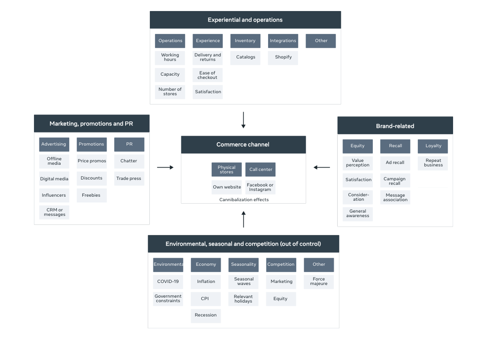

```{r setup, include=FALSE, warning=FALSE, message=FALSE}
knitr::opts_chunk$set(echo = TRUE)
```

---

## Robyn Optimization Objective

1. Model fit - Minimize NRMSE.
2. Business fit -  Minimize DECOMP RSSD.
3. Experiments - Minimize MAPE

## Robyn Seasonality
1. [Prophet](https://facebook.github.io/prophet/docs/quick_start.html).

---

## Key Concepts

#### **1. ROAS (Return on Advertising Spend)**

ROAS stands for "Return on Advertising Spend," and it is a key metric used in market mix modeling (MMM) to evaluate the effectiveness of advertising campaigns. ROAS measures the revenue generated for each unit of advertising spend, typically expressed as a ratio or percentage.

In market mix modeling, companies analyze various marketing and advertising channels (e.g., TV, radio, digital ads, print media) along with other external factors (e.g., seasonality, economic conditions) to understand how each channel contributes to overall sales or revenue. The goal is to optimize the allocation of marketing budgets across different channels to maximize return on investment (ROI) and achieve business objectives.

To calculate ROAS, you divide the revenue generated by a specific advertising campaign or channel by the advertising spend for that campaign or channel. The formula for ROAS is as follows:

ROAS = Revenue from Advertising Campaign / Advertising Spend

For example, if an advertising campaign generates $10,000 in revenue, and the total advertising spend for that campaign is $2,000, the ROAS would be:

ROAS = $10,000 / $2,000 = 5

An ROAS value of 5 means that for every dollar spent on the advertising campaign, the company earned $5 in revenue. Higher ROAS values indicate better performance, as the company is generating more revenue for each advertising dollar spent. Market mix modeling helps businesses identify which marketing channels have the highest ROAS and guide them in optimizing their marketing strategies to achieve the best possible return on their advertising investments.

----

#### **2. MROAS (Marketing Return on Advertising Spend)**
MROAS stands for "Marketing Return on Advertising Spend." It is a metric used to measure the return on investment (ROI) for specific marketing activities or advertising campaigns. MROAS is similar to ROAS (Return on Advertising Spend), but it takes into account all marketing expenses, not just advertising expenses.

In MROAS calculations, all marketing expenses, including advertising costs, production costs, promotional expenses, and other marketing-related expenditures, are considered in relation to the revenue generated from those marketing activities.

The formula for MROAS is as follows:

MROAS = Revenue from Marketing Activities / Total Marketing Expenses

For example, if a company's marketing activities generated $100,000 in revenue, and the total marketing expenses (including advertising costs, production costs, and promotions) were $20,000, the MROAS would be:

MROAS = $100,000 / $20,000 = 5

An MROAS value of 5 means that for every dollar spent on marketing activities, the company earned $5 in revenue.

MROAS is a comprehensive metric that provides insights into the overall effectiveness of a company's marketing efforts. It helps businesses understand the efficiency of their marketing strategies and identify which marketing activities or campaigns are contributing the most to revenue generation. By tracking MROAS, companies can optimize their marketing budgets and make data-driven decisions to achieve better ROI on their marketing investments.

----

#### **3. NRMSE (Normalized Root Mean Squared Error)**
NRMSE stands for "Normalized Root Mean Squared Error." It is a metric used to evaluate the performance of a predictive model, particularly in the context of regression analysis or time series forecasting. NRMSE is a variation of the Root Mean Squared Error (RMSE), but it scales the RMSE by the range of the data to make the metric comparable across different datasets.

The formula for calculating NRMSE is as follows:

NRMSE = RMSE / (max(Y) - min(Y))

where:

RMSE is the Root Mean Squared Error, which measures the average difference between the predicted values and the actual values.
max(Y) is the maximum value in the actual target variable (Y).
min(Y) is the minimum value in the actual target variable (Y).
By dividing the RMSE by the range of the data, NRMSE provides a relative measure of the model's accuracy, independent of the scale of the data. This makes it easier to compare the performance of different models when dealing with datasets that have different ranges or units.

NRMSE values range from 0 to 1, where 0 indicates a perfect fit (the predicted values match the actual values exactly) and 1 indicates the worst fit (the predicted values have the same variability as the actual values). Lower NRMSE values indicate better model performance.

NRMSE is widely used in various fields, including statistics, machine learning, and time series analysis, to assess the accuracy of predictive models and to compare different modeling approaches. It helps researchers and practitioners determine how well their models generalize to new data and make informed decisions about model selection and improvement.

----

#### **5. Response Curves**

1.  Linear: Straight line. Represents constant returns.

2. Concave: Represents diminishing returns.

3. Convex: Represents increased returns as investment increases.

4. S-Shaped: Starts as convex and becomes concave. 


#### **6. Data For MMM**

Date, response (or CRV), spend, impressions, clicks, events, organic (like newsletter). 

Other MMM Variables:

```{r, echo=FALSE, out.width="80%", fig.align='center'}

```

----

### DECOMP RSSD (Decomposition Root Sum Square Distance)
